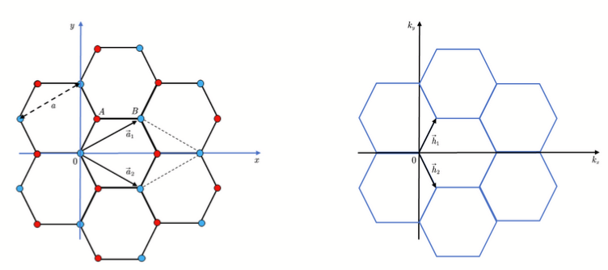

# Graphene Research

> Created by Rainzor

The basic properties of graphene: structure, dispersion,DOS and energy bands. You can see [docs(CN)](/docs) for more detail. The source code is in [src](/src).

### Structure

    
     
    

        Figure 1. Structure
    

    
 

### Phonon

    
     
    

        Figure 2. Dispersion
    

    
 

    
     
    

        Figure 3. Phonon DOS
    

    
 

### Electron

    
     
    

        Figure 4. Energy Band
    

    
 

    
     
    

        Figure 5. Electron DOS
    

    
 

