# 固体物理小论文——石墨烯调研

## 1. 简介

石墨烯是由碳原子构成的一种二维材料，具有许多独特的性质，包括出色的热学性质和电子性质。石墨烯的发现引起了全球科学界的高度关注，并且已经在许多领域中得到了广泛应用，例如电子元件、传感器、能源存储和转换等

作为碳的单原子平面，石墨烯可以包裹成其他石墨材料，如富勒烯、碳纳米管和石墨烯薄膜。由于内部具有极高的晶体质量和无质量狄拉克费米子，单层石墨烯表现出异常的半整数量子霍尔效应、卓越的光学性能、超高的本征强度、优良的导热性和极高的载流子迁移率。它被称为零间隙半导体，由于费米能级附近独特的狄拉克锥带结构，显示出异常高的电荷载流子浓度和弹道传输。此外，无质量电子在亚微米距离内无散射地通过蜂窝晶格的传播使得即使在室温下也可以研究石墨烯中的量子效应 

## 2. 石墨烯结构

    
     
    

        Figure 2.1. 石墨烯纳米带分类 （a）椅型边纳米带，（b）锯齿边纳米带，（c）螺旋边纳米带
    

    
 

理想的石墨烯是具有正六方晶格结构的单层二维原子晶体。 C-C键的长度约为0.142 nm，层厚为0.35 nm。在每个状态下，单个碳原子通过 $sp^2$ 轨道杂化分别与其三个最近的邻居形成强 σ 键，导致占据和未占据状态相互远离。石墨烯的每个晶胞都有A型和B型两种亚晶格

    
     
    

        Figure 2.2. 石墨烯晶胞
    

    
 

设 $a_0=0.142 nm$,晶格常数为 $a=\sqrt3 a_0$,那么石墨烯的晶胞基矢可以写为

$$
\mathbf{a_1}= \frac{a}{2}(\sqrt 3,1)\\
\mathbf{a_2}= \frac{a}{2}(\sqrt 3,-1)
$$

那么晶格的倒格矢定义为

$$
\mathbf{b_1}=\frac{2\pi}{a}(\frac{1}{\sqrt 3},1)\\
\mathbf{b_2}=\frac{2\pi}{a}(\frac{1}{\sqrt 3},-1)
$$

倒格子空间中，格点之间的最小间距是： $b_0=\frac{4\pi}{3\sqrt3a_0}$

### 2.1 最近邻矢量

$$
\delta_1=\frac{a_0}{2}(1,\sqrt3)\\
\delta_2=\frac{a_0}{2}(1,-\sqrt3)\\
\delta_3=-a_0(1,0)
$$

### 2.2 化学键 

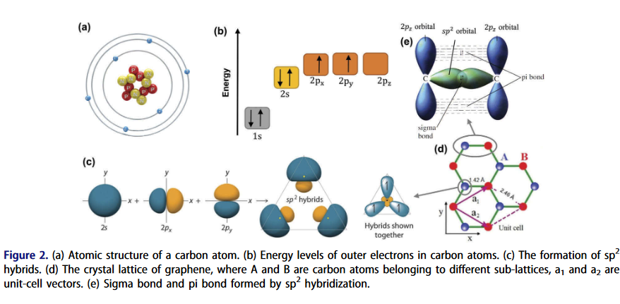

碳是元素周期表中的第六元素，基态电子排布为 $1s^2,2s^2,2p_x^1,2p_y^1,2p_z^0$ ,当碳原子与其相邻的三个碳原子共享 $sp^2$ 电子时，它们形成一层平面结构的蜂窝网络，也称为单层石墨烯。

在石墨烯层上两个相邻碳原子的典型 $sp^ 2$ 杂化中，面外 $\pi$ 键由垂直于平面结构的 $2p_z$ 轨道组成，而面内σ键由 $sp^2$ ($2s$ , $2p_x$ 和 $2p_y$ )杂化轨道形成。

产生的共价 $\sigma$ 键具有约 $1.42\overset{\circ}{A}$ 的短原子间长度，使其甚至比金刚石中的 $sp^3$ 杂化碳-碳键更强，从而赋予单层石墨烯显着的机械性能（例如 $1 T Pa$ 的杨氏模量和固有抗拉强度为 $130.5 GPa$)。

在单层石墨烯中，π 键杂化在一起形成 π 带和 π * 带。这些带通过允许自由移动电子的半填充带负责石墨烯的大部分显着电子特性。由于允许电子自由移动的半满π带，形成了零带隙的导带和价带。此外, $\pi$ 键在双层和多层石墨烯中的相邻石墨烯层之间提供了弱的范德华相互作用。

### 2.3 结合能

​	在一定力程范围内，考虑到原子间短程相互作用，石墨烯的平均相互作用能为：

$$
\phi(d)=-V_2\left[1-\frac{9R}{V_2 d^ {12}}+5\beta_2\left(\frac{V_1}{V_2}\right)^2\right]
$$

式中 $V_2$ 为两原子的 $sp^2$ 轨道 $\sigma$ 键的共价能, 它与原子间距离 $d$的平方成反比:

$$
V_2=3.26\frac{\hbar}{m_ed^2}=\frac{B}{d^2}
$$

其中 $m_e$ 为电子质量。而 $V_1$ 为金属化能, $V_1=(\epsilon_s-\epsilon_p)/4=2.08 eV$, $\epsilon_s$ 和 $\epsilon_p$ 分别是 $s$ 和 $p$ 态电子的能量;  $R=10.08eV\times(10^{-10}m)^{12}$ , $\beta_2$ 是与维数有关的参量, 对石墨烯 $\beta_2=2/3$

    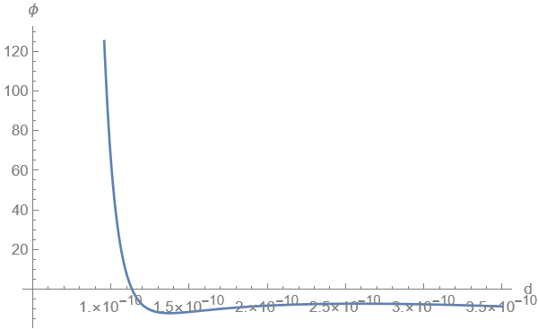
     
    

        Figure 3.1. 结合能
    

    
 

求导可以得到稳定平衡点

$$
d_0 =1.37354\times10^{-10}m
$$

和实验值 $a_0=1.42\times 10^{-10}m$ 相比，比较接近

## 3. 晶格振动

### 3.1 晶格动力学

##### 动力学矩阵

根据晶格动力学，对于任意处于 $i$ 坐标处 $\mathbf u_i=(x_i,y_i,z_i)^T$,其对于含有N个原子的晶胞，受到的作用力可以写作

$$
M_i\frac{d^2u_i}{dt^2}=\sum_jK^{(i,j)}(u_j-u_i),\qquad(i=1,...,N)\tag {4.1}
$$

其中 $K^{(i,j)}$ 代表了 $i$ 和 $j$ 之间的  $3\times 3$ 的弹性张量矩阵。

对于上述微分方程，由于一个原胞中含有两个独立的格点 $A,B\in R^3$，所以设试探解为

$$
u^A=A\exp[i(\mathbf{k\cdot (r-r_{Ai})}-wt)]\\
u^B=B\exp[i(\mathbf{k\cdot (r-r_{Bi})}-wt)]
$$

代入(4.5) ，如果假设 $u _ i $ 是 $A$ 原子，且由于所有原子质量 $M_i$ 都一样，得到

$$
-Mw^2I\mathbf u_i^A=\sum_{j_A}K^{(i,j_A)}(\mathbf u_{j_A}^A-\mathbf u_i^A)+\sum_{j_B}K^{(i,j_B)}(\mathbf u_{j_B}^B-\mathbf u_i^A)
$$

其中 $j_A，j_B$ 分别代表了 $u_i$ 受到的作用力来自 A类原子和B类原子，继续代入，消去 $u_i$

$$
-AMw^2I=\sum_{j_A}K^{(i,j_A)}\left(e^{-i\mathbf{k\cdot\Delta r_{ij_A}}}-1\right)A+\sum_{j_B}K^{(i,j_B)}\left(e^{-i\mathbf{k\cdot\Delta r_{ij_B}}}B-A\right)
$$

其中 $\Delta r_{ij}$ 是两个原子的相对距离，整理一下得到，

$$
\left(\sum_jK^{(ij)}-\sum_{j_A}K^{(i,j_A)}e^{-i\mathbf{k\cdot\Delta r_{ij_A}}}\right)A-\sum_{j_B}K^{(i,j_B)}e^{-i\mathbf{k\cdot\Delta r_{ij_B}}}B=Mw^2A
$$

同理 $B$ 原子应该在方程形式上和 $A$ 原子等价，得到

$$
-\sum_{j_A}K^{(i,j_A)}e^{-i\mathbf{k\cdot\Delta r_{ij_A}}}A+\left(\sum_jK^{(ij)}-\sum_{j_B}K^{(i,j_B)}e^{-i\mathbf{k\cdot\Delta r_{ij_B}}}\right)B=Mw^2B
$$

注意 $A,B$ 是一个 $R^{3\times1}$ 的向量，得到一下特征方程

$$
\begin{bmatrix}
\left(\sum_jK^{(ij)}-\sum_{j_A}K^{(i,j_A)}e^{-i\mathbf{k\cdot\Delta r_{ij_A}}}\right)& -\sum_{j_B}K^{(i,j_B)}e^{-i\mathbf{k\cdot\Delta r_{ij_B}}}\\
-\sum_{j_A}K^{(i,j_A)}e^{-i\mathbf{k\cdot\Delta r_{ij_A}}}& \left(\sum_jK^{(ij)}-\sum_{j_B}K^{(i,j_B)}e^{-i\mathbf{k\cdot\Delta r_{ij_B}}}\right)
\end{bmatrix}
\begin{bmatrix}
A\\
\\
B
\end{bmatrix}
=Mw^2
\begin{bmatrix}
A\\
\\
B
\end{bmatrix}
$$

可以将上面的 $6\times6$ 动力学矩阵分块

$$
D=\begin{bmatrix}
D^{AA}&D^{AB}\\
D^{BA}&D^{BB}
\end{bmatrix}
$$

##### 近邻原子 

同时为了简化问题，只考虑到第4近邻的原子作用 [[6]](#refer-anchor-6)

    
     
    

        Figure 4.1. 近邻原子
    

    
 

##### 弹性张量

A原子最邻近的原子有 $B_1,B_2,B_3$ [[6]](#refer-anchor-6)

    
     
    

        Figure 4.2. 作用力
    

    
 

对于最邻近的原子 $A,B_1$ 之间的张量矩阵在特征空间下，可以写作

$$
K^{(A,B_1)}=\begin{bmatrix}
\phi_r^{(1)}&0&0\\
0&\phi_{ti}^{(1)}&0\\
0&0&\phi_{to}^{(1)}
\end{bmatrix}
$$

而其他的原子的张量矩阵可以通过旋转变换矩阵来实现

$$
K^{(A,B_m)}=U_mK^{(A,B_1)}U_m\quad (m=2,3)
$$

其中旋转矩阵 $U_m$ 为

$$
U_m=\begin{pmatrix}
\cos\theta_m&\sin\theta_m&0\\
-\sin\theta_m&\cos\theta_m&0\\
0&0&1
\end{pmatrix}
$$

对于考虑到第4临界的弹性张量矩阵，在特征空间下矩阵的值为 [6](#refer-anchor-6)

    
     
    

        Figure 4.3. 弹性系数，其中的单位是10N/m
    

    
 

### 3.2 色散关系

根据 `dispersion_3D.m` `dispersion_2D.m` 可以得到一下色散关系图

##### 三维

    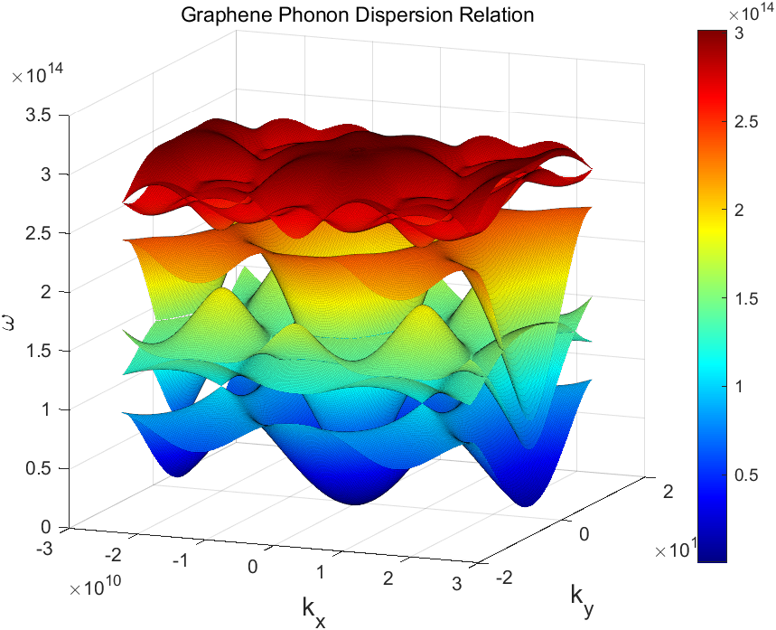
     
    

        Figure 4.4. 色散关系3D
    

    
 

##### 二维

当沿着 $\Gamma,M,K,\Gamma$ 方向画出平面色散关系

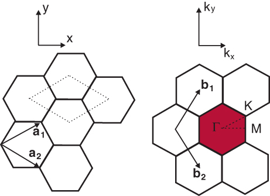

    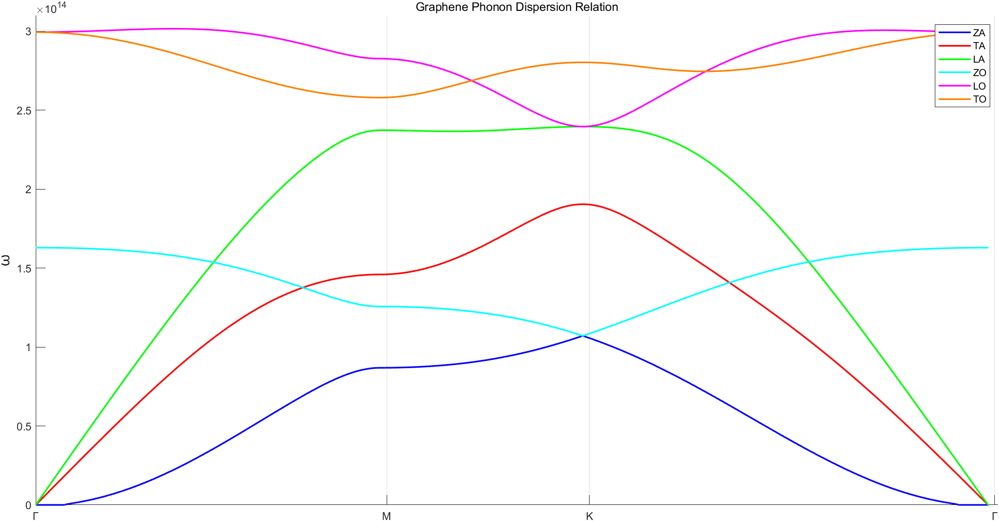
     
    

        Figure 4.5. 色散关系
    

    
 

##### X-W投影平面

    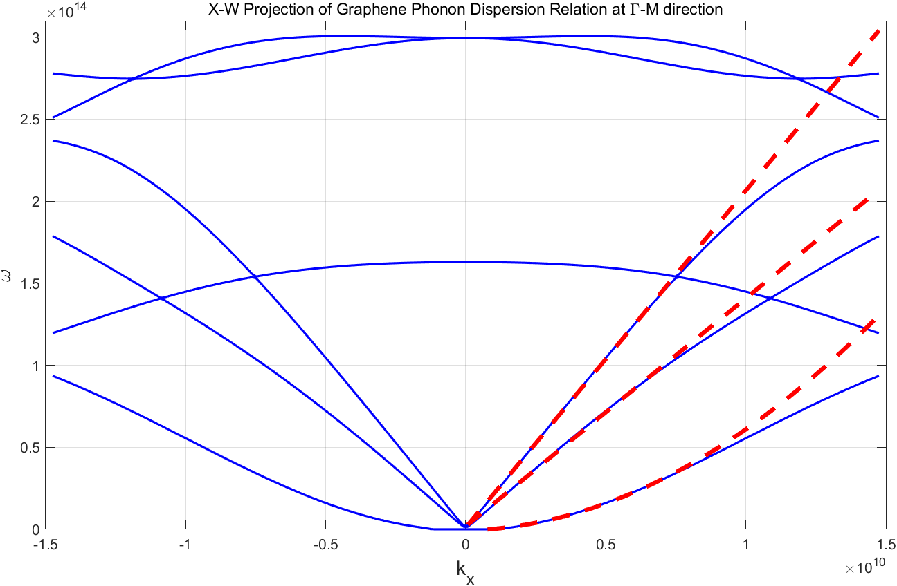
     
    

        Figure 4.6. X-W色散关系
    

    
 

从图像中可以看到一下一些结论

1. 对于原胞中有2个原子的石墨烯材料，共有 $3\times2$支色散波段。其中3只为声学支，为 ZA,TA,LA；3只为光学波段，为ZO,LO,TO
2. 纵向 (L) 模式对应于沿波传播方向（压缩波）的原子位移，而横向 (T) 模式对应于垂直于传播方向（剪切波）的面内位移。在典型的三维 (3D) 固体中，横向模式可以具有两个等效极化，但石墨烯独特的二维性质允许面外原子位移，也称为弯曲 (Z) 声子。
3. 在低频区间，声学支占主导，且曲线变化比较陡峭，占据了大多数频率区间；而光学支只在高频处占主导，且占据范围较小
4. 在布里渊区中心附近的低 k 处，横向声学支 (TA) 和纵向声学支 (LA) 模式的频率具有线性色散,即 $w_{TA}\approx v_{TA}k$ ， $ω_{LA} \approx v_{LA}k$ ，由于石墨烯的在面内 $\sigma$ 键和小质量特性，其具有较大的群速度 $v_{TA}\approx 13.9 km/s$ , $v_{LA}\approx 20.5 km/s$ (模拟拟合曲线)
5. 在布里渊区中心附近的低 k 处，弯曲 ZA 模式具有近似二次色散,$w_{ZA}\approx \alpha k^2$,其中 $\alpha = 5.7 \times 10^-7 m^2/s$(模拟曲线拟合) ，正是 ZA 模式的存在和修改是造成石墨烯许多不寻常的热特性的原因。比如高热导率：

### 3.3 杨氏模量

可以用经验公式导出杨氏模量

$$
E=\rho v_g^2
$$

其中 $\rho=2.2\times10^3 kg/m^3$ 为石墨烯密度； $v_g$ 为石墨烯声速。

如果把上面声学支的色散关系都认为是线性的，那么在这种程度近似下，声速是

$$
v_g^2=(v_{TA}^2+v_{LA}^2+v^2_{ZA})/3=4.923\times 10^8 (m/s)^2
$$

于是可以得到石墨烯的杨氏模量

$$
E=1.0832\times10^{12} Pa
$$

于实验值 [[8]](#refer-anchor-8) 相比 $1.0\pm0.1 TPa$ 已经非常接近了

### 3.4 态密度

利用提供的代码 `DOS_frequency.m`， 对第一布里渊区内进行统计，可以得到如下频率态密度分布

    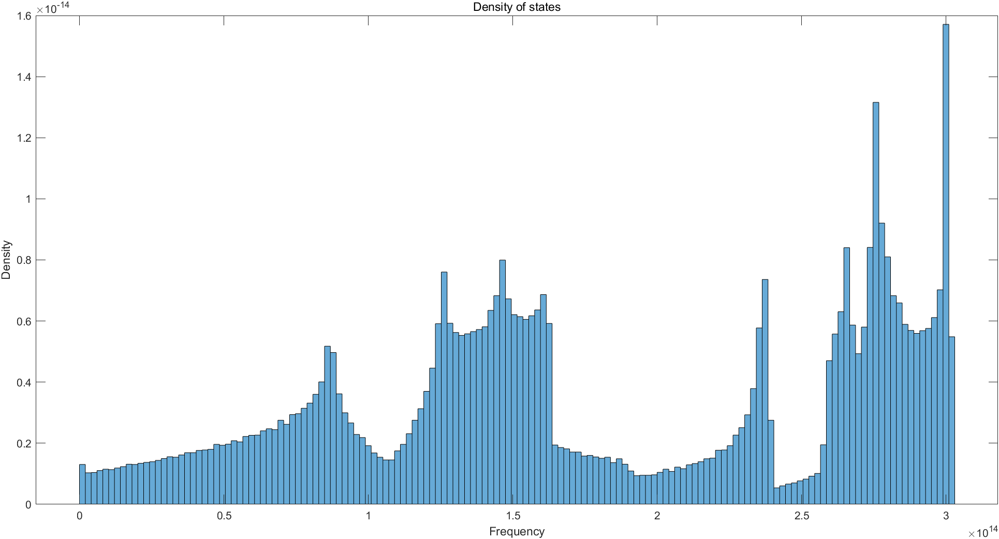
     
    

        Figure 4.7. 态密度分布
    

    
 

在频率较低处是声学支占主导，态密度近似为单调的线性函数形式，但是在$1.5\times10^{14}$ 以及在大于 $2.5\times 10^{14}$ 处光学支发挥作用，态密度激增。(文献中给出的态密度如下)[[7]](#refer-anchor-7) 

    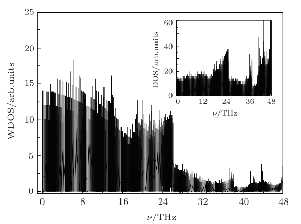
     
    

        Figure 4.8. 实际态密度
    

    
 
                  

## 4. 热容

### 4.1 Dulong-Petit 定律

考虑经典能均分定理，得到其摩尔热容为

$$
C_V=3N_ak_B=24.943 J\cdot mol^{-1}\cdot K^{-1}
$$

### 4.2  Einstein Model

在与环境温度处于热平衡状态时谐振子按时间的平均能量为:

$$
\bar\varepsilon_i=\frac{\hbar\omega_i}{2}+\frac{\hbar\omega_i}{e^{\hbar\omega_i/k_BT}-1}
$$

Einstein Model 认为所有原子处于相同的频率，对于石墨烯中近似认为 $\omega_E=2\times10^{14} rad/s$，进而得到 $Einstein$ 温度 $T_E$

$$
T_E=\frac{\hbar\omega_E}{k_B}=1.53\times 10^3 K
$$

对于N个原胞的石墨烯系统，每个原胞中含有两个原子 $n=2$,得到热容为

$$
C_V=3Nnk_B\frac{\partial}{\partial T}\left(\frac{\hbar\omega_E}{e^{\hbar\omega_i/k_BT}-1}\right)=3Nnk_B\left(\frac{T_E}{ T}\right)^2\frac{e^{T_E/T}}{(e^{T_E/T}-1)^2}=3Nnk_Bf_E(\frac{T_E}T)
$$

在高温下： $f_E(T_E/T)\approx1$

$$
C_V\approx 3Nnk_B=3N_Ak_B
$$

在低温时：

$$
C_V=3Nnk_B\left(\frac{T_E}T\right)^2e^{-T_E/T}
$$

### 4.3 Debye Model

Debye（1912）修正了原子是独立谐振子的概念，而考虑晶格的集体振动模式，他假设晶体是连续弹性介质，原子的热运动以弹性波的形式发生。弹性波频率上限 $\omega_D$，称之为德拜频率

$$
\omega=v_sq\\
\frac{3}{v_s^2}=\frac1{v_{TA}^2}+\frac1{v_{LA}^2}+\frac1{v^2_{ZA}}
$$

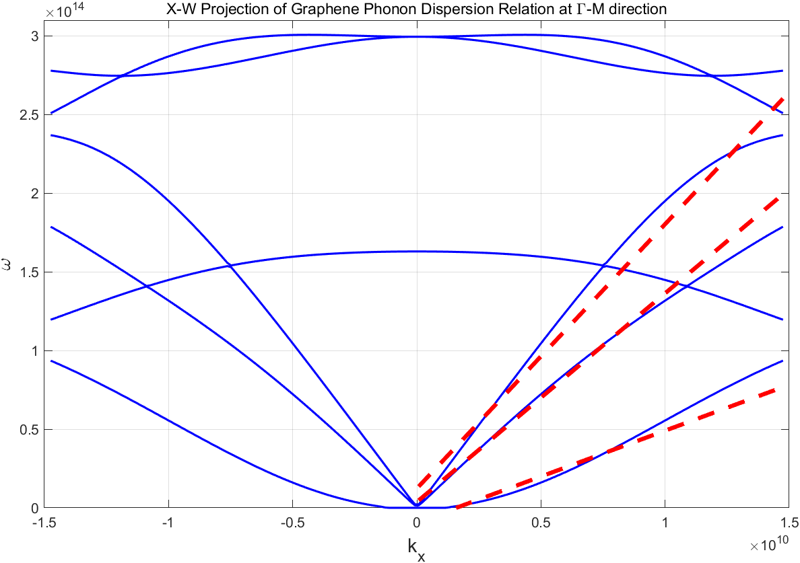

对于弹性波，二维平面中色散关系是

$$
g(w)=\frac{S\omega}{2\pi}\left(\frac1{v_{TA}^2}+\frac1{v_{LA}^2}+\frac1{v^2_{ZA}}\right)=\frac{3S\omega}{2\pi v_s^2}
$$

其中 $S$ 是平面总面积，为 $\frac{3\sqrt3 a_0^2}{2}N$。

由于有N个原胞，每个原胞有2个原子，自由度为6，所以总振动模式有 $6N$个，所以有：

$$
\int_0^{\omega_D}g(w)dw=6N\\
\omega_D=\left(\frac{8\pi N}{S}\right)^{1/2}v_s\approx 1.6734\times10^{14} rad/s
$$

有此得到 $Debye$ 温度 $T_D=\frac{\hbar w_D}{k_B}\approx1273.24 K$

结合统计力学，Bose-Einstein分布和Debye近似的态密度分布，可以得到Debye热容为

$$
\begin{aligned}
C_V&=\sum_qk_B\left(\frac{\hbar w_q}{k_BT}\right)^2\frac{\exp(\frac{\hbar w_q}{k_BT})}{\left(\exp(\frac{\hbar w_q}{k_BT})-1\right)^2}\\
&=\int_0^{w_D}dw\cdot g(w) k_B\left(\frac{\hbar w}{k_BT}\right)^2\frac{\exp(\frac{\hbar w}{k_BT})}{\left(\exp(\frac{\hbar w}{k_BT})-1\right)^2}\\
(T\rightarrow0)\quad&=12Nk_B\left(\frac{T}{T_D}\right)^2\int_0^{\infty}\frac{e^x x^3}{(e^x-1)^2}dx
\end{aligned}
$$

以上得到在低温时， **$Debye$ 热容正比于 $T^2$**

### 4.4 Debye Model 修正

从下图可以看到，对于 ZA 模，色散关系更加接近二次关系

而且实际的Debye温度 $T_D^{exp}=2100K$,与 4.4.2中求出 $1273.24K$ 相比，差距比较大，

所以对态密度矩阵进行修正，考虑二次色散关系

$$
w_{ZA}=\alpha q^2\\
g_{ZA}(w)=\frac{S}{4\pi \alpha}
$$

那么此时总态密度函数可以写作

$$
\begin{aligned}
g(w)&=\frac{S\omega}{2\pi}\left(\frac1{v_{TA}^2}+\frac1{v_{LA}^2}\right)+\frac{S}{4\pi \alpha}=\frac{S\omega}{\pi v_g^2}+\frac{S}{4\pi \alpha}
\end{aligned}
$$

同理，由于总态数目的限制，得到Debye频率：

$$
\int_0^{\omega_D}g(w)dw=6N\\
\omega_D\approx 3.36148\times10^{14}
$$

有此得到修正的 $Debye$ 温度 $T_D=\frac{\hbar w_D}{k_B}\approx2557.65K$，比较接近实验值 $T_D^{exp}=2100K$

此时可以得到热容的表达式

$$
\begin{aligned}
C_V&=\int_0^{w_D}dw\cdot g(w) k_B\left(\frac{\hbar w}{k_BT}\right)^2\frac{\exp(\frac{\hbar w}{k_BT})}{\left(\exp(\frac{\hbar w}{k_BT})-1\right)^2}\\
(T\rightarrow0)\quad&=\left(\frac{k_B^3S}{\pi v_g^2\hbar^2}\int_0^\infty\frac{e^x x^3}{(e^x-1)^2}dx\right)\times T^2+
\left(\frac{k_B^2S}{4\pi \alpha\hbar}\int_0^\infty\frac{e^xx^2}{(e^x-1)^2}dx\right)\times T\\
&=AT^2+BT
\end{aligned}
$$

可以看到在极低温处，**热容应当是与温度呈线性**，其中 $A=5.8\times10^{-5},B=2.6\times 10^{-2}$,修正后图像如下，在 $0-100K$ 范围内保持了良好的线性

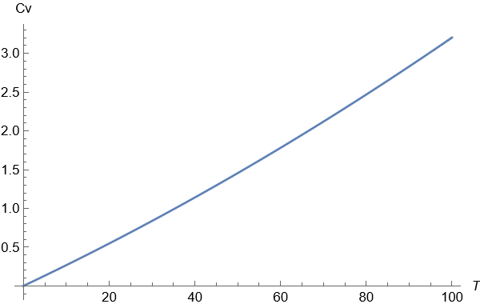

### 4.5 实际热容

根据晶格动力学求解出的态密度分布：

结合统计力学和Bose-Einstein分布：

$$
C_V=\sum_qk_B\left(\frac{\hbar w_q}{k_BT}\right)^2\frac{\exp(\frac{\hbar w_q}{k_BT})}{\left(\exp(\frac{\hbar w_q}{k_BT})-1\right)^2}
$$

    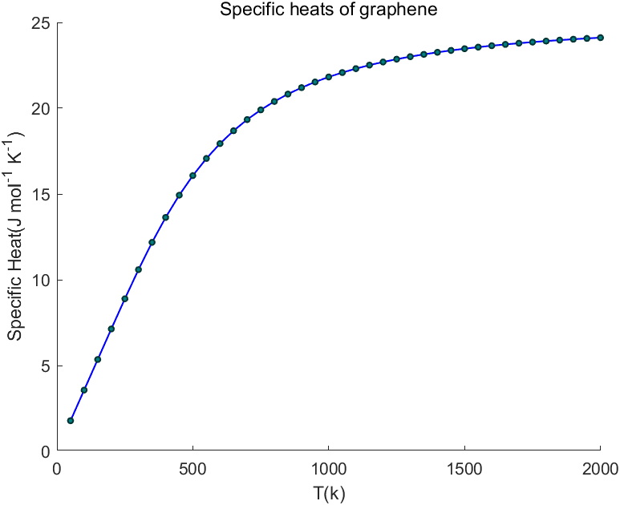
    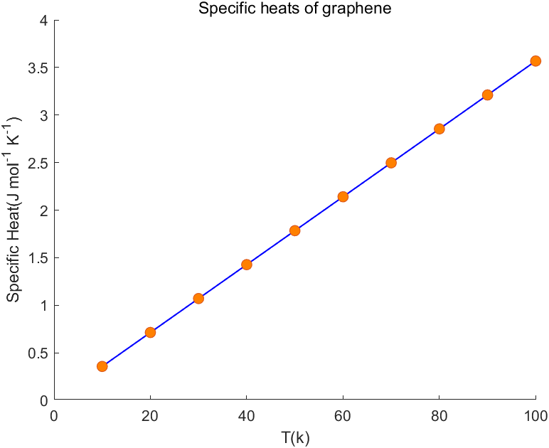
     
    

        Figure 4.8. 热容随温度变化
    

    
 

可以看到在低温处，比热容确实保持了线性，这正是 ZA 模式下色散关系呈现二次关系导致的。文献中给出的热容如下：  [[4]](#refer-anchor-4)

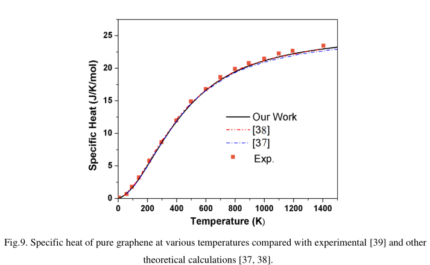

## 5. 电子特性

### 5.1 Sommerfeld 自由电子论

如果按照Sommerfeld的自由电子气理论，可以计算二维石墨烯结构在T=0K 处的费米能、费米半径、费米速度：

$$
k_F=\sqrt{4\pi n}=1.54\times10^{10} m^{-1}\\
E_F=\frac{\hbar^2k_F^2}{2m}=9.14eV\\
v_F=\frac{\hbar k_F}{m}=1.78\times10^6m/s
$$

不过石墨烯并不是经典意义上的金属，其费米半径是大于第一布里渊区心到边界的距离 $k_{min}=\pi/a\approx1.28\times10^{10}m^{-1}$

### 5.2 紧束缚近似

按照紧束缚近似，认为电子主要在原子附近，下面考虑 $\pi$ 电子的能带, 设总本征态为 $\ket{\Psi}$

由Schrödinger方程

$$
\widehat H\ket{\Psi_k}=E_k\ket{\Psi_k}\\
\widehat H=-\frac{\hbar^2}{2m}\widehat p^2+V(\widehat r)=-\frac{\hbar^2}{2m}\widehat p^2+\sum_{R_A}u(\widehat r-R_A)+\sum_{R_B}u(\widehat r-R_B)\tag{5.1}
$$

其中 $V(r)$ 是考虑所有晶格原子势场的结果；$u(r)$ 是一个中心碳原子的势场

按照紧束缚近似理论，考虑总本征态 $\ket{\Psi }$ 是A原子和B原子本征态 $\ket\phi$ 的叠加：

$$
\ket{\Psi_k}=C_A\ket{\phi_k^A}+C_B\ket{\phi_k^B}\\
\ket{\phi_k^A}=\frac1{\sqrt N}\sum_{R_A}e^{ikR_A}\varphi(r-R_A)\\
\ket{\phi_k^B}=\frac1{\sqrt N}\sum_{R_B}e^{ikR_B}\varphi(r-R_B)
$$

其中 $\ket \phi$ 是一个孤立电子和原子核之间的 $2p$轨道的本征态

$$
\widehat H\ket\varphi=-\frac{\hbar^2}{2m}\widehat p^2+u(\widehat r)\ket{\varphi}=\varepsilon_{2p}\ket\varphi\tag{5.2}
$$

对 （5.1）的公式分别左乘 $\bra{\phi_k^A},\bra{\phi_k^B}$，得到如下形式的方程组

$$
(H_{AA}-E_kS_{AA})C_A+(H_{AB}-E_kS_{AB})C_B=0\\
(H_{BA}-E_kS_{BA})C_A+(H_{BB}-E_kS_{BB})C_B=0\tag{5.3}
$$

如果写成矩阵的形式：

$$
(H-E_kS)\begin{bmatrix}C_A \\ C_B\end{bmatrix}=0\tag{5.4}
$$

下面分别来看 $H_{\alpha\beta},S_{\alpha\beta}$ 的表达式: ($\alpha,\beta \in\{A,B\}$)

对于 $H_{AA}$，有如下表达

$$
\begin{aligned}
H_{AA}&=\bra{\phi_k^A}\widehat H\ket{\phi_k^A}=\frac1N\sum_{i=1}^N\sum_{j=1}^Ne^{ik(R_{Ai}-R_{Aj})}\bra{\varphi(r-R_{Ai})}\widehat H\ket{\varphi(r-R_{Aj})}\\
(只考虑自身相互作用)\quad&=\frac1N\sum_{i=1}^N\bra{\varphi(r-R_{Ai})}\widehat H\ket{\varphi(r-R_{Ai})}\\
&\approx\varepsilon_{2p}
\end{aligned}\tag{5.5}
$$

同理 $H _ {BB}\approx\varepsilon _ {2p}$

对于 $H _ { AB}$，有如下表达

$$
\begin{aligned}
H_{AB}&=\bra{\phi_k^A}\widehat H\ket{\phi_k^B}=\frac1N\sum_{i=1}^N\sum_{j=1}^Ne^{ik(R_{Ai}-R_{Bj})}\bra{\varphi(r-R_{Ai})}\widehat H\ket{\varphi(r-R_{Bj})}\\
\end{aligned}\tag{5.6}
$$

对于此表达式，只考虑最邻近原子相互作用，如下:

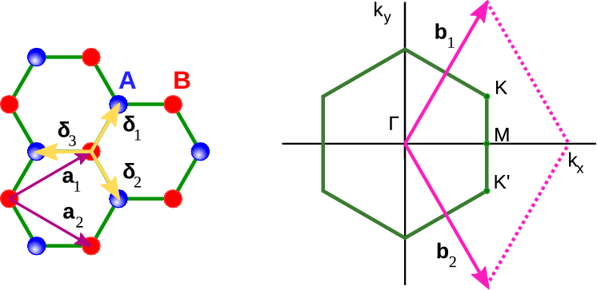

$$
\delta_1=\frac{a_0}{2}(1,\sqrt3)=\frac{a}{2}(\frac{1}{\sqrt3},1)\\
\delta_2=\frac{a_0}{2}(1,-\sqrt3)=\frac{a}{2}(\frac{1}{\sqrt3},-1)\\
\delta_3=-a_0(1,0)=-a_0(\frac{1}{\sqrt 3},0)
$$

所以(5.6)可以得到：

$$
\begin{aligned}
H_{AB}&=\frac1N\sum_i\sum_{\delta_i}e^{ik\delta_i}\bra{\varphi(r-R_{Ai})}\widehat H\ket{\varphi(r-R_{Bj})}\\
&=-\frac{\gamma_0}{N}\sum_if(\mathbf k)=-\gamma_0f(\mathbf k)
\end{aligned}\tag{5.7}
$$

其中:

$$
\begin{aligned}
\gamma_0&=-\bra{\varphi(r-R_{Ai})}\widehat H \ket{\varphi(r-R_{Bj})}\\
&=-\bra{\varphi(r)}\widehat H \ket{\varphi(r+(R_{A_i}-R_{Bj})}\\
&=-\bra{\varphi(r)}\widehat H \ket{\varphi(r-\delta)}\qquad(对称性,与\delta 方向无关)\\
\end{aligned}
$$

$$
\begin{aligned}
f(\mathbf k)&=\sum_{\delta_i}e^{-i\mathbf k \cdot \mathbf{\delta_i}}=e^{ik_xa/\sqrt3}+2e^{-ik_xa/2\sqrt3}\cos(k_ya/2)
\end{aligned}
$$

由厄米性:

$$
H_{AB}=H^*_{BA}
$$

同样得道理可以得到：

$$
S_{AA}=S_{BB}=1\\
S_{AB}=S_{BA}^*=-S_0f(\mathbf k)\\
S_0=-\bra{\varphi(r)}\ket{\varphi(r-\delta)}\tag{5.8}
$$

结合（5.4）式有解条件以及（5.5）（5.7）（5.8），有

$$
det(H-E_kS)=0
$$

$$
H=
\begin{bmatrix}\varepsilon_{2p}&-\gamma_0f(\mathbf k)\\
-\gamma_0f^*(\mathbf k)&\varepsilon_{2p}
\end{bmatrix}
$$

$$
S=
\begin{bmatrix}1&-s_0f(\mathbf k)\\
-s_0f^*(\mathbf k)&1
\end{bmatrix}
$$

得到方程的解为

$$
E_k=\frac{\varepsilon_{2p}\pm\gamma_0|f(\mathbf k)|}{1\mp s_0|f(\mathbf k)|} \tag{5.9}
$$

其中查阅文献[[9]](#refer-anchor-9) 可得 $\bf{\gamma_0=3.033 eV,s_0=0.129eV}$，并取 $\varepsilon_{2p}=0eV$, 而 $\vert f(k)\vert$

$$
|f(\mathbf k)|=\sqrt{1+4\cos(\sqrt3k_xa/2)\cos(k_ya/2)+4\cos^2(k_ya/2)}
$$

根据(5.9)可以画出 $\pi$ 轨道的能带结构（ `energy_band.m`）

    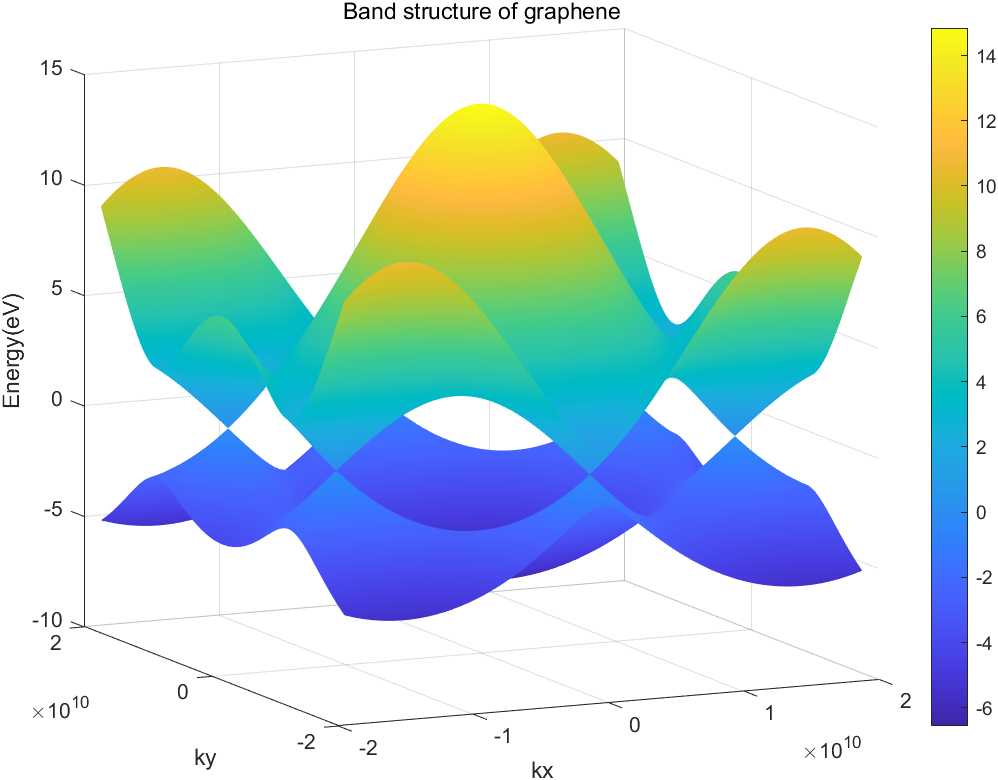
     
    

        Figure 5.1. 能带结构
    

    
 
                  

有时会近似忽略 $s_0$,即令 $s_0=0eV$,此时可以将能带结构简化为：

$$
E_k=\pm\gamma_0|f(\mathbf k)|\tag{5.10}
$$

### 5.3 能态密度

由于已经求出了能带结构，很自然的可以画出能态密度（`DOS_energy.m`）

    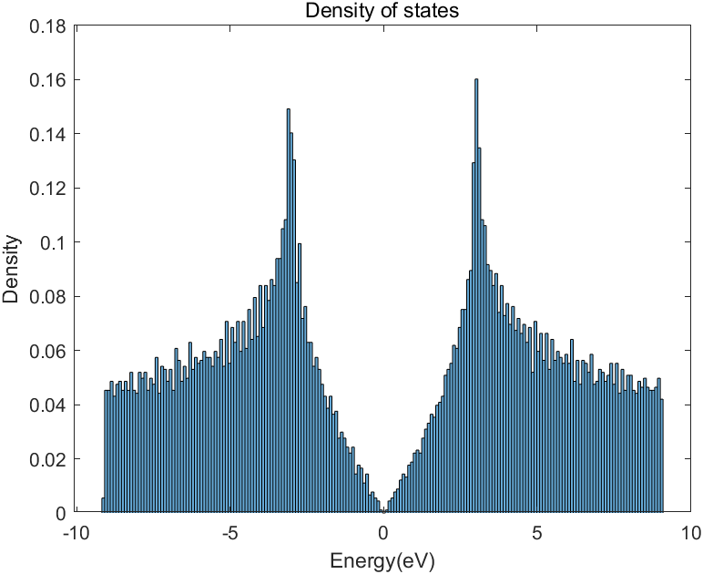
     
    

        Figure 5.2. 能态密度
    

    
 
                  

从文献中可以给出石墨烯能态密度 $\rho_g(\epsilon)$ 的表达式  [[10]](#refer-anchor-10)

$$
\rho_g(\epsilon)=\left\{\begin{aligned}
&0\quad &\epsilon<-\frac D2\\
&-\frac{\rho_m}{2\epsilon}\Delta\quad&-\frac D2<\epsilon<-\frac\Delta2\\
&\frac{2\rho_m|\epsilon|}{\Delta}\quad&-\frac\Delta2<\epsilon<\frac\Delta2\\
&\frac{\rho_m}{2\epsilon}\Delta\quad&\frac\Delta2<\epsilon<\frac D2\\
&0\quad &\frac D2<\epsilon
\end{aligned}\right.
$$

其中 $\rho_m=\frac{4}{[1+2\ln(D/\Delta)]\Delta},\Delta=6eV,D=18.4eV$ ，得到下图

    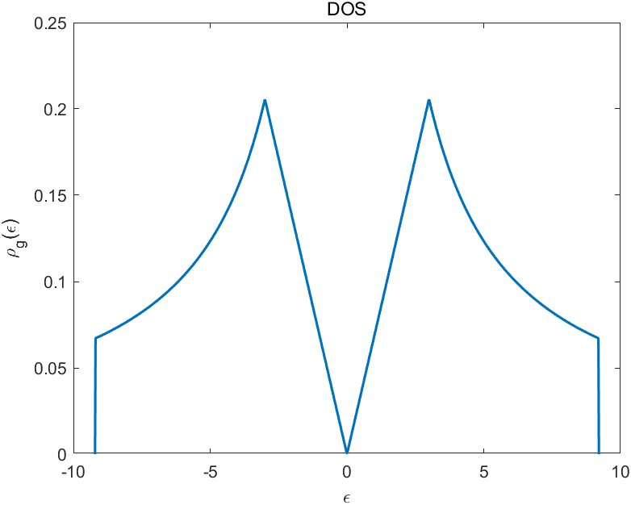
     
        
 
                  

还有一种表示形式是： [[2]](#refer-anchor-2)

    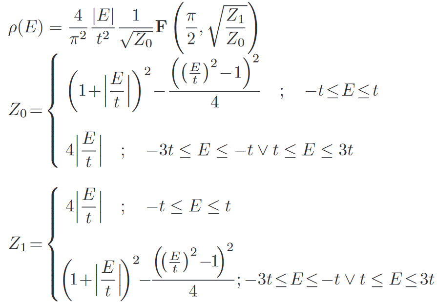
     
        
 
                  

其中 $\bf F(\pi/2,x)$ 是第一类椭圆积分，图像如下

    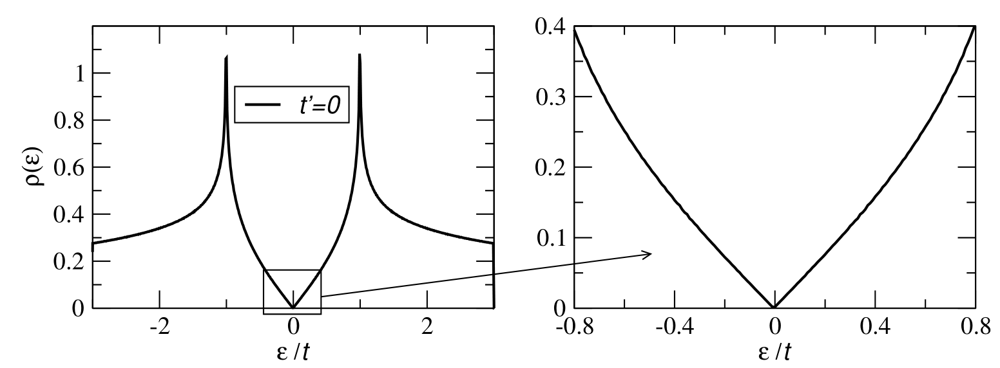
     
        
 
                  

### 5.4 Van Hove 奇点

对于 $M$ 处的电子态密度具有 Van Hove 奇点

    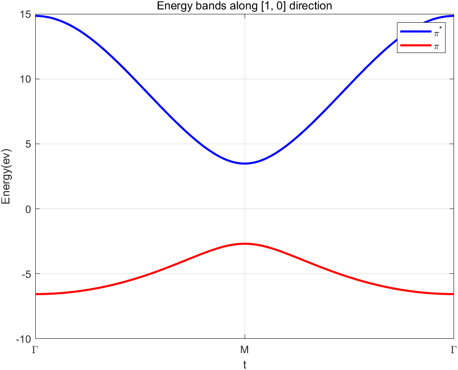
     
    

        Figure 5.3. Γ-M-Γ 二维能带结构
    

    
 
                  

### 5.5 Dirac点

如果只考虑到 $\pi$ 轨道的两个电子，从紧束缚近似模型中可以看到，两个电子自旋上下填满了的能量较低的能带；然而从图像中可以看到上下的价带和导带在 $K$ 点处接触，能隙为0，正是在此处，**石墨烯具有了独特的半金属性**。观察其二维平面能带：

    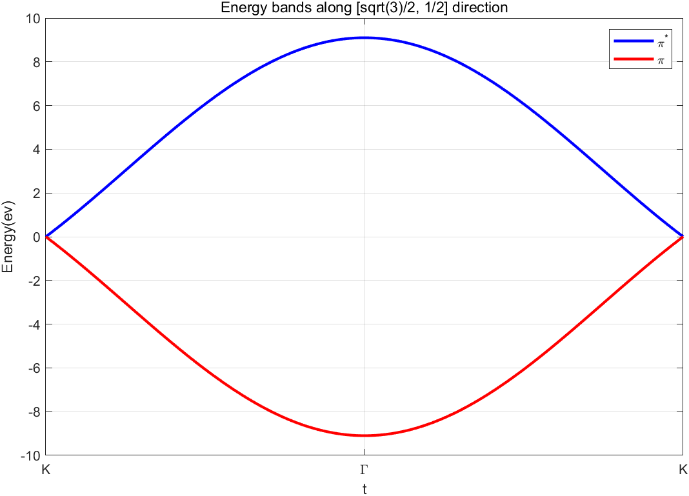
     
    

        Figure 5.4. K-Γ-K 二维能带结构
    

    
 
                  

结合三维视图，可以看到在布里渊区边界处（K和K'点）有六个锥, 这六个锥便是 **狄拉克锥(Dirac cone) 。在每个锥上，上下能带简并在一个点，该点便称为狄拉克点(Dirac point)**,这些点分别是 

$$
(0,\pm\frac{4\pi}{3}),(\pm\frac{4\pi}{3},0 ),(\pm\frac{2\pi}{\sqrt 3 a},\pm\frac{2\pi}{3a}),(\pm\frac{2\pi}{\sqrt 3 a},\mp\frac{2\pi}{3a})
$$

在 $K,K'$ 点附近对(5.10)进行 $Taylor$ 展开，忽略高阶小量，能够得到如能量与动量线性关系：

$$
E_{\pm}=\pm\frac{\sqrt3\gamma_0 a}{2}\sqrt{(k_x-k_{Kx})^2+(k_y-k_{Ky})^2}=\pm v_F\hbar |\mathbf {k-k_K}|\tag{5.11}
$$

其中 $v_F\approx9.8\times 10^5 m/s\approx c/100 $，接近光速 

在描述电子运动时，我们可以把一个在晶格内运动的电子等效为一个在自由空间中运动的电子。类似地引入有效质量的概念，将晶体中的场对于电子的影响等效于自由空间运动的电子的质量 $\frac1{m^*}\sim\frac{d^2 E}{dk^2}$ ，由于色散关系为线性，且在能量为零的点对称，导致 E(k) 在 K 点不连续，导致二阶导数无穷大，电子的有效质量为零。所以此时用薛定谔方程来描述粒子的运动已无效，应该运用引入了相对论效应的狄拉克方程来描述。

$$
\widehat H\ket{\Psi_k}=iv_F\sigma\cdot\nabla\ket{\Psi_k}=E_k\ket{\Psi_k}\tag{5.12}
$$

在 $K,K'$ 处的波函数为

$$
{\Psi_K(k)}=\frac1{\sqrt2}\begin{pmatrix}e^{-i\theta_k/2}\\
\pm e^{i\theta_k/2}
\end{pmatrix}\\
{\Psi_{K'}(k)}=\frac1{\sqrt2}\begin{pmatrix}e^{i\theta_k/2}\\
\pm e^{-i\theta_k/2}
\end{pmatrix}={\Psi_K^*(k)}\tag{5.13}
$$

这样的狄拉克费米子波函数有着很显著的隧穿效应  [[2]](#refer-anchor-2) ，如下图所示，假设入射的波函数为 

$$
{\Psi_K(k)}=\frac1{\sqrt2}\begin{pmatrix}1\\
\pm e^{i\theta_k}
\end{pmatrix}
$$

    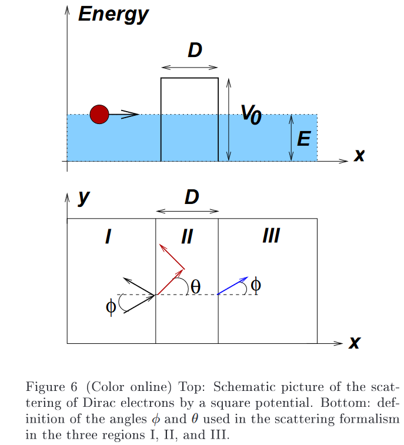
       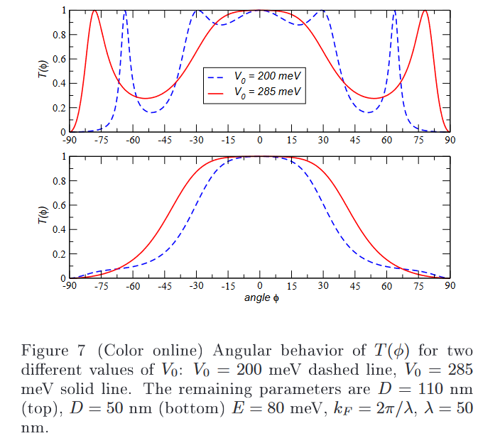
     
    

        Figure 5.5. 隧穿效应
    

    
 
                  

透过率的表达式为

$$
T(\phi)=\frac{\cos^2\theta\cos^2\phi}{[\cos(Dq_x)\cos\phi\cos\theta]^2+\sin^2(Dq_x)(1-ss'\sin\phi\sin\theta)^2}
$$

其中 $q_x=\sqrt{(V_0-E)^2/v_F^2-k_y^2}$, $\phi=\arctan(k_y/k_x)$, $\theta=\arctan(k_y/q_x)$

即使在 $|V_0|\gg |E|$时， 由边界条件得到穿透率为

$$
T(\phi)\approx\frac{\cos^2\phi}{1-\cos^2(Dq_x)}sin^2\phi
$$

当 $\phi$ 趋近于0时，透过率仍然接近1，这意味着石墨烯中的电子和空穴具有很长的自由程，电子受到温度的影响比较小，石墨烯具有很高的电子迁移率，因而**石墨烯有良好的导电性**。

## 6. Summary

本次关于石墨烯的调研从石墨烯特殊的晶格结构出发，讨论晶体中常见的性质和参数：倒格矢，化学键和结合能等。利用晶格动力学求解了石墨烯色散关系，并利用色散关系讨论了石墨烯的杨氏模量、热容、态密度等性质，并发现石墨烯在低温下具有二次的色散关系，使得石墨烯具有良好的导热能量以及低温热容与温度成正比的关系。最后研究了石墨烯的电子特性，从索末菲的自由电子论出发，再到紧束缚近似求出石墨烯的能带结构，能态密度；并着重讨论石墨烯在倒易空间中的 $K$ 点处具有特别的性质，使得石墨烯呈现出半金属性和优良的导电能力。 

## 7. Reference

1. [Sang, Mingyu, et al. "Electronic and thermal properties of graphene and  recent advances in graphene based electronics applications." *Nanomaterials* 9.3 (2019): 374.](https://www.semanticscholar.org/paper/Electronic-and-Thermal-Properties-of-Graphene-and-Sang-Shin/fd184c530f1b2e92a8ad647f4917a6f4763bb220)
2. [Neto, AH Castro, et al. "The electronic properties of graphene." *Reviews of modern physics* 81.1 (2009): 109.](https://arxiv.org/abs/0709.1163)
3. [Fuchs, Jean-Noel, and Mark Oliver Goerbig. "Introduction to the physical properties of graphene." *Lecture notes* 10 (2008)](https://web.physics.ucsb.edu/~phys123B/w2015/pdf_CoursGraphene2008.pdf)
4. [Mann, Sarita, et al. "Thermodynamic properties of pure and doped (B, N) graphene." *RSC advances* 6.15 (2016): 12158-12168.](https://www.researchgate.net/publication/291339016_Thermodynamic_properties_of_pure_and_doped_B_N_graphene)
5. [Pop, Eric, Vikas Varshney, and Ajit K. Roy. "Thermal properties of graphene: Fundamentals and applications." *MRS bulletin* 37.12 (2012): 1273-1281.](https://arxiv.org/abs/1301.6181)
6. [Dresselhaus, G., Mildred S. Dresselhaus, and Riichiro Saito. *Physical properties of carbon nanotubes*. World scientific, 1998.](https://doi.org/10.1142/p080)
7. [叶振强, 曹炳阳, and 过增元. "石墨烯的声子热学性质研究." *物理学报* 63.15 (2014): 154704-154704.](https://wulixb.iphy.ac.cn/pdf-content/10.7498/aps.63.154704.pdf)
8. [Memarian, Farzaneh, A. Fereidoon, and M. Darvish Ganji. "Graphene Young’s modulus: Molecular mechanics and DFT treatments." *Superlattices and Microstructures* 85 (2015): 348-356](https://www.sciencedirect.com/science/article/pii/S0749603615300239)
9. [Yang, Gao, et al. "Structure of graphene and its disorders: a review." *Science and technology of advanced materials* 19.1 (2018): 613-648.](https://www.tandfonline.com/doi/full/10.1080/14686996.2018.1494493)
10. [Davydov, S. Yu, and G. I. Sabirova. "Model of adsorption on graphene." *Physics of the Solid State* 53 (2011): 654-664.](https://www.researchgate.net/profile/Sergei-Davydov/publication/251341039_Model_of_adsorption_on_graphene/links/54994c3e0cf21eb3df5f9009/Model-of-adsorption-on-graphene.pdf)
11. [殷隆晶, 乔佳斌, and 何林. "双层转角石墨烯的结构和电学性质." *物理学进展* 36.3 (2016): 65.]

